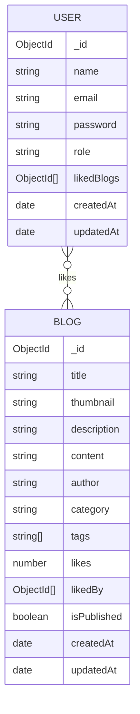

# CareerCoded Blog Management Platform

A complete monolithic MERN-style blog management system for CareerCoded. One Express server serves both the REST API and the React frontend. Admins can create, update, publish, unpublish, and delete blogs. Users can register, login, read published blogs, search/filter content, and like or unlike posts.

## Tech Stack

- Frontend: React, Vite, React Router, Axios, CSS
- Backend: Node.js, Express.js, MongoDB, Mongoose
- Authentication: JWT, bcrypt password hashing
- UI: Responsive public pages, user profile, admin dashboard, admin blog manager

## Features

- User registration and login
- Admin login with role-based authorization
- Protected API routes
- Blog CRUD for admins
- Publish and unpublish support
- Blog listing, details, search, category filter, pagination
- Like and unlike blogs for logged-in users
- Admin dashboard with total blogs, published blogs, drafts, likes, and recent posts
- Duplicate email prevention and required field validation

## Folder Structure

```bash
client/
  src/
    components/
    context/
    hooks/
    pages/
    services/
server/
  config/
  controllers/
  middleware/
  models/
  routes/
  utils/
```

## Setup

1. Install dependencies:

```bash
npm run install:all
```

2. Create server environment file:

```bash
cp server/.env.example server/.env
```

3. Create client environment file:

```bash
cp client/.env.example client/.env
```

4. Start MongoDB locally or update `MONGO_URI` in `server/.env`.

5. Create the first admin:

```bash
npm run seed:admin --prefix server
```

Default admin values are defined in `server/.env.example`.

6. Run the monolithic app:

```bash
npm run dev
```

App: `http://localhost:5000`

API health check: `http://localhost:5000/api/health`

`npm run dev` builds the React app into `client/dist` and starts the Express server. Express serves the frontend and API from the same port.

## API Documentation

All protected endpoints require:

```http
Authorization: Bearer <jwt-token>
```

### Authentication

| Method | Endpoint | Access | Description |
| --- | --- | --- | --- |
| POST | `/api/auth/register` | Public | Register a user |
| POST | `/api/auth/login` | Public | Login as user |
| GET | `/api/auth/me` | User/Admin | Get current user |
| POST | `/api/admin/login` | Public | Login as admin |
| GET | `/api/admin/dashboard` | Admin | Dashboard statistics |

### Blogs

| Method | Endpoint | Access | Description |
| --- | --- | --- | --- |
| GET | `/api/blogs` | Public/Admin | List blogs. Public sees published blogs only. |
| GET | `/api/blogs/:id` | Public/Admin | Get one blog |
| POST | `/api/blogs` | Admin | Create blog |
| PUT | `/api/blogs/:id` | Admin | Update blog |
| DELETE | `/api/blogs/:id` | Admin | Delete blog |
| POST | `/api/blogs/:id/like` | User/Admin | Like blog |
| DELETE | `/api/blogs/:id/unlike` | User/Admin | Unlike blog |

### Blog Query Parameters

`GET /api/blogs`

| Parameter | Example | Description |
| --- | --- | --- |
| `search` | `react` | Search title, description, and tags |
| `category` | `Interview` | Filter by category |
| `page` | `2` | Page number |
| `limit` | `9` | Items per page |
| `published` | `false` | Admin-only draft filtering |

### Example Request Bodies

Register:

```json
{
  "name": "Asha Patel",
  "email": "asha@example.com",
  "password": "Password123"
}
```

Create blog:

```json
{
  "title": "How to Prepare for Frontend Interviews",
  "thumbnail": "https://images.unsplash.com/photo-1498050108023-c5249f4df085",
  "description": "A practical interview preparation guide for junior frontend developers.",
  "content": "Write the full blog content here...",
  "author": "CareerCoded Team",
  "category": "Interview",
  "tags": ["React", "JavaScript", "Career"],
  "isPublished": true
}
```

## Database Schema Diagram



## Security Notes

- Passwords are hashed with bcrypt before storage.
- JWT payload stores user id, email, and role.
- Admin-only routes use both authentication and role checks.
- Secrets and database URLs belong in `.env`, not source control.

## Deployment Notes

- Deploy one Node.js web service from the repository root.
- Build command: `npm install && npm run build`
- Start command: `npm run deploy:start`
- The React app is served by Express from `client/dist`, and API requests use relative `/api`, so no separate frontend hosting is required.
- Use MongoDB Atlas for production and set `MONGO_URI` in the hosting dashboard.
- Set `JWT_SECRET` to a long random secret, and change `ADMIN_PASSWORD` before seeding/admin use.

### Render Deployment

1. Push this project to GitHub.
2. Create a MongoDB Atlas database and copy the connection string.
3. In Render, choose **New +** > **Blueprint** and select this repository. Render will read `render.yaml`.
4. Add the secret environment variables when Render asks:

```bash
MONGO_URI=mongodb+srv://...
JWT_SECRET=your-long-random-secret
ADMIN_EMAIL=admin@careercoded.com
ADMIN_PASSWORD=your-strong-password
```

5. Deploy the service. After the first deploy, open the Render shell and run:

```bash
npm run seed:admin --prefix server
```

6. Open the Render URL. The same URL serves the frontend and backend, for example:

```bash
https://careercoded-blog.onrender.com
https://careercoded-blog.onrender.com/api/health
```
